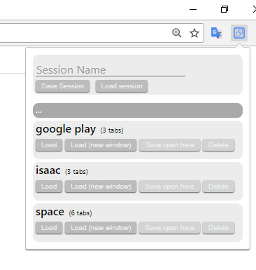
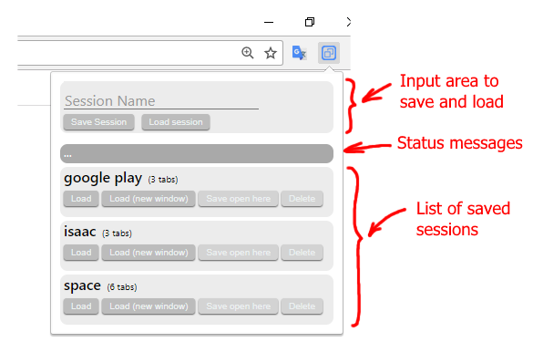

# yast (Yet Another Save Tabs)

Lightweight Chrome extensión that saves navigation sessions

## Why another ?

I always wanted a little extension that allows me to save navigation sessions and restore them later, but having a plethora of this extensions none of them have two things, simplicty and unobtrusiveness.

All the ones I used have so many options, or use synced storage (i dont' want nor need my sessions traveling to google in order to be synced), or uses the background  model that remains in background to comunicate with the extesion, or request so many permissions in manifest, or simply they are not opensource. 

## Features
* Does not use background page model, only does things when you open it
* Does not use storage event listeners.
* Does not use the innerHTML, instead composes the DOM by code, this is to avoid banning in Firefox when I have time to port it (And just in case Google decides to ban it in its extensions, which would not be uncommon)
* Uses Chrome local storage, and not the session synced one, so nonthing travels through the net
* According to google docs, should be easy to adapt it to use synced storage, if you want synced sessions simply change all ".local.storage" by ".sync.storage" and all should work
* You can restore a session by clicking in the list or by name
* Take care, the delete buttons does not ask for confirmation (I dont like the popups nor alerts)

## Interface
* In top area
    * Textbox : name of session to be saved or loaded
    * Save session : saves all current tabs with session name in textbox
    * Load session : loads a session with session name in textbox

* Bottom area (session list)
    * Load : loads the session in current window without clossing the currently open tabs
    * Load (new window) : loads the session in a new Chrome window
    * Save open here : saves all open tabs in the session replacing the old ones
    * Delete : deletes the session

## Screenshots

* Clean : 

<table>
    <tr>
        <td>
            
        </td>
    </tr>
</table>

* Explained

<table>
    <tr>
        <td>
            
        </td>
    </tr>
</table>

# Warning

This code can help you to learn how to develop chrome extensions, but if you want use it that is another history, due to really evil behaviours of google, let's see :

* Leaving apart the Chrome store there are two ways of install Chrome extensions, unpacked and packed (crx file)
    * if you install via unpacked one, every time you open google Chrome it shows you a popup warning about you installed extensions in developer mode, all works but is really annoying being forced to close a popup every time you open the browser
    * installing it via crx is even worse because google disables all extensions installed this way that are not instaled via in chrome store

To publish in chrome store you must pay 5$ to google, fill all the forms and stuff, and pray for not have other problems with google, their policies changes, or whatever they want in that moment.

I became aware of all this things after develop this extension, I do not want to pay 5$ to google, and most important I do not want worry about fill forms, and stay updated with Chrome store, so finally totally switched to Firefox, all of this only to use an extension that I have deloped and is in my local computer

So as soon as I have some spare time and can check if Firefox does not have this problems I will make a version of this extension for Firefox.

In the mean time if you want to install and use this extension without the annoying popup, here is a excelent step by step tutorial with screenshots to install extensions that are not in Chrome store (I know it works because I have tested it before to put the link) :
[http://yutouyes.blogspot.com.es/2016/12/using-crx-extensions-added-offline-in.html](http://yutouyes.blogspot.com.es/2016/12/using-crx-extensions-added-offline-in.html)

All can say is please dont use chrome, google has becomed probably the most evil company that anyone could imagine.
